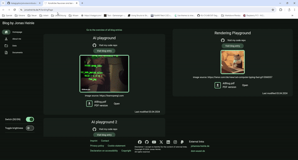

<h1 align="center">
  <br>
  <a href="https://jonasheinle.de"></a>
  <br>
  Jotrockenmitlocken
  <br>
</h1>

<!-- <h1 align="center">
  <br>
  <a href="https://jonasheinle.de"></a>
  <a href="https://jonasheinle.de"></a>
  <a href="https://jonasheinle.de"></a>
</h1> -->

<h4 align="center">My personal blog as responsive web app using Flutter/Dart. 
Every blog post is written in pure markdown :boom: and therefore very lightweight to use 
and add new content. 
It is highly customizable for your needs, your personal web blog or you next Frontend 
project (<b>not only</b> web but also native Linux/Windows/Android/Web/iOS)
<a href="https://jonasheinle.de" target="_blank"></a>.</h4>

<p align="center">
  <br>
  <a href="https://jonasheinle.de"></a>
  <br>
  <br>
</p>

> **__Note__**: If your run locally this website you are not able to
neither navigate to the blog entries nor the book/film/... critics. 
Their "source content .md files" are my intellectual property and therefore only visible to me :) 
The flutter/dart source code stays
**__Open Source__** of course

Visit [jonasheinle.de](https://jonasheinle.de/) for the full experience of my personal web blog. Cheers! :beers: </br>
Visit my repo [jotrockenmitlockenrepo](https://github.com/Kataglyphis/jotrockenmitlockenrepo) if you are interested 
in Flutter/Dart development in general. 
All components in this repo are reusable for any target available (Linux/Windows/Android/Web).  

🚀 Markdown is great 🚀:  
If you also love the lightweight markdown approach you might be interested in 
my [md2pdf](https://github.com/Kataglyphis/Kataglyphis-mdToPdf)-project that even allows you to convert markdown to a a4paper PDF or presentation slides PDF :satisfied:   
🎉🎉🎉


[](https://github.com/Kataglyphis/jotrockenmitlocken/actions/workflows/dart.yml)
[]() 
[](https://www.paypal.com/paypalme/JonasHeinle)
[](https://twitter.com/Cataglyphis_)

<p align="center">
  <a href="#key-features">Key Features</a> •
  <a href="#how-to-use">How To Use</a> •
  <a href="#download">Download</a> •
  <a href="#credits">Credits</a> •
  <a href="#related">Related</a> •
  <a href="#license">License</a>
</p>

<!-- TABLE OF CONTENTS -->
<details open="open">
  <summary>Table of Contents</summary>
  <ol>
    <li>
      <a href="#about-the-project">About The Project</a>
      <ul>
        <li><a href="#built-with">Built With</a></li>
      </ul>
      <ul>
        <li><a href="#key-features">Key Features</a></li>
      </ul>
    </li>
    <li>
      <a href="#getting-started">Getting Started</a>
      <ul>
        <li><a href="#prerequisites">Prerequisites</a></li>
        <li><a href="#installation">Installation</a></li>
      </ul>
    </li>
    <li><a href="#tests">Tests</a></li>
    <li><a href="#roadmap">Roadmap</a></li>
    <li><a href="#contributing">Contributing</a></li>
    <li><a href="#license">License</a></li>
    <li><a href="#contact">Contact</a></li>
    <li><a href="#acknowledgements">Acknowledgements</a></li>
  </ol>
</details>

<!-- ABOUT THE PROJECT -->
## About The Project

I always wanted an easy way to publish new content :metal: 
(blog posts, thoughts about books,...) fast. 
But why not just using a CMS? Here are my reasons:
  * as the content is pure markdown my approach allows me to always change the technology easily, 
    many CMS integrate the content very strongly into their technology
    * therefore you will not make yourself dependent from my repo. You are always able to switch :cat2:
  * what if I want to build an UI for a native Linux application? Than all effort brought
    into building a web blog with a CMS is more or less useless. With this project I have
    a very huge reusable part leverage me to build also native UIs (with a Rust backend :rocket: f.e.)
  * I want a very unique look and feel for my website. Therefore I want all power over my
  application which can be difficult with some drag-and-drop solutions.
  * I want to learn front-end development and its challenges. Just using wordpress won't bring you there


### Content
I truly believe in open source. Hence you will get all source code for free use and ready to go.</br>
My approach allows me to separate the website data from its view (MVC best practice). 
You will not see my blog posts(only the dummy entries) in this repo. They are my intellectual property :wink:</br>
The `assets` directory houses all files you want to include within your application namely:
* images
* videos
* data (.zip, .csv, ...)
* documents (f.e. .md for blog posts)
* fonts 
* and the settings directory which harbors many different options for your own needs:
  * global user settings: Here you can easily customize the blog for you. 
    Set all necessary user related options (like email, name, image, etc...)
  * All entries in the user_skills.json will be displayed in the corresponding section.
* app settings: set the app name, title. You are able to disable the footer; 
  the **supportedLocales** field can have the following values:
  * ["de"]: build a web app in pure german
  * ["en"]: build a web app in pure english
  * ["de","en"] or :["en","de"] You can switch between english and german

### Publish a new blog post
If you want to add a new blog bost do the following steps:

* Open the file `assets\settings\blog_settings.json`
* Append an entry like the following:
```json
{
		"routingName":"/aiBlog2",
		"shortDescriptionEN":"AI playground 2",
		"shortDescriptionDE":"AI Spielwiese 2",
		"filePath":"assets/documents/blog/aiBlogPageEn.md",
		"imageDir":"assets/images/aiBlog",
		"githubRepo":"MachineLearningAlgorithms",
		"fileTitle": "AIBlog.pdf",
		"fileAdditionalInfo": "PDF version",
		"fileBaseDir": "assets/documents/blog/",
		"lastModified":"03.04.2024",
		"landingPageAlignment":"left",
		"landingPageEntryImagePath": "assets/images/ML_CV.jpeg",
		"landingPageEntryImageCaptioning": "image source: https://pyimagesearch.com/2023/03/30/machine-learning-computer-vision/",
		"docsDesc": [
			{
				"baseDir":"assets/documents/cv/",
				"title":"CV_Jonas_Heinle_english.pdf",
				"additionalInfo": "~3.7MB English"
			},
			{
				"baseDir": "assets/documents/cv/",
				"title": "CV_Jonas_Heinle_german.pdf",
				"additionalInfo": "~3.7MB German"
			},
			{
				"baseDir": "assets/data/",
				"title": "WorleyNoiseTextures.zip",
				"additionalInfo": "Use it for you own projects."
			}
		]
	},
```

### Publishing posts over a book

* Open the file `assets\settings\my_two_cents_settings.json`
* Add an entry like the following
```json
{
		"routingName":"/books/fuenfGeheimnisse",
		"filePath":"assets/documents/books/fuenfGeheimnisse.md",
		"imageDir":"assets/images/aiBlog",
		"mediaTitle":"Die fünf Geheimnisse, die Sie entdecken sollten, bevor Sie sterben",
		"fileBaseDir": "assets/documents/books/",
		"docsDesc": [
			{
				"baseDir":"assets/documents/cv/",
				"title":"CV_Jonas_Heinle_english.pdf",
				"additionalInfo": "~3.7MB English"
			},
			{
				"baseDir": "assets/documents/cv/",
				"title": "CV_Jonas_Heinle_german.pdf",
				"additionalInfo": "~3.7MB German"
			},
			{
				"baseDir": "assets/data/",
				"title": "WorleyNoiseTextures.zip",
				"additionalInfo": "Use it for you own projects."
			}
		]
	},
```
* Make sure that the mediaTitle you add here is availabale in the `assets\data\Buecherliste_gelesen.csv` file.
### Localization

This project generates localized messages based on arb files found in
the `lib/src/localization` directory.

To support additional languages, please visit the tutorial on
[Internationalizing Flutter
apps](https://flutter.dev/docs/development/accessibility-and-localization/internationalization)

<!-- <h1 align="center">
  <br>
  <a href="https://jonasheinle.de"></a>
  <a href="https://jonasheinle.de"></a>
  <a href="https://jonasheinle.de"></a>
</h1> -->

<!-- [![Kataglyphis Engine][product-screenshot1]](https://jonasheinle.de)
[![Kataglyphis Engine][product-screenshot2]](https://jonasheinle.de)
[![Kataglyphis Engine][product-screenshot3]](https://jonasheinle.de) -->

### Key Features

<!-- ❌  -->
|          Feature                                 |   Implement Status |
| :-----------------------------------------:      | :----------------: |
| Add you media critics(books,films,..) easily     |         ✔️         |
| Markdown rendering                               |         ✔️         |
| Publish blog posts by only editing a .json       |         ✔️         |
| Display .csv data                                |         ✔️         |
| High degree of customization for yourself        |         ✔️         |
| Make your files (CV,thesis,..) open-/downloadable|         ✔️         |

### Built With

* [Flutter/Dart](https://flutter.dev/)
* [WebDavClient](https://github.com/Kataglyphis/Kataglyphis-WebDavClient) Wrote my own WebDavClient for this repo :)

<!-- GETTING STARTED -->
## Getting Started

For help getting started with Flutter development, view the
[online documentation](https://flutter.dev/docs), which offers tutorials,
samples, guidance on mobile development, and a full API reference.

### Run Web Server locally for Debugging 

```bash
flutter run -d web-server --web-renderer canvaskit --profile --web-port 8080 --web-hostname 0.0.0.0
```

### Prerequisites

### Installation

1. Clone the repo
   ```sh
   git clone --recurse-submodules git@github.com:Kataglyphis/jotrockenmitlocken.git
   ```

<!-- ROADMAP -->
## Roadmap
Upcoming :)
<!-- See the [open issues](https://github.com/othneildrew/Best-README-Template/issues) for a list of proposed features (and known issues). -->

<!-- CONTRIBUTING -->
## Contributing

Contributions are what make the open source community such an amazing place to be learn, inspire, and create. Any contributions you make are **greatly appreciated**.

1. Fork the Project
2. Create your Feature Branch (`git checkout -b feature/AmazingFeature`)
3. Commit your Changes (`git commit -m 'Add some AmazingFeature'`)
4. Push to the Branch (`git push origin feature/AmazingFeature`)
5. Open a Pull Request


<!-- LICENSE -->
## License
MIT.

## Known Issues
flutter_highlighter needs and update in line 94 from RichText to Text.rich to make it
selectable. The developer just dont want to integrate the feature ...
flutter_markdown is not in a very stable version. I had to manually edit 
the blockquote section for centering it. At the time of writing this 
they have an open issue on not being able to build and MarkdownBuilder for a 
blockquote. 

<!-- CONTACT -->
## Contact

Jonas Heinle - [@Cataglyphis_](https://twitter.com/Cataglyphis_) - jonasheinle@googlemail.com

Project Link: [https://github.com/Kataglyphis/jonasheinle.de](https://github.com/Kataglyphis/jotrockenmitlocken)


<!-- ACKNOWLEDGEMENTS -->
<!-- ## Acknowledgements

You will find important links to information in the code.
But here in general some good sources of information: -->

<!-- Thanks for free 3D Models: 
* [Morgan McGuire, Computer Graphics Archive, July 2017 (https://casual-effects.com/data)](http://casual-effects.com/data/)
* [Viking room](https://sketchfab.com/3d-models/viking-room-a49f1b8e4f5c4ecf9e1fe7d81915ad38) -->

## Literature 

Some very helpful literature, tutorials, etc. 

Flutter/Dart
* [Johannes Milke](https://www.youtube.com/@JohannesMilke)
* [package repository for Dart and Flutter apps](https://pub.dev/)
* [Official flutter web example](https://flutter.github.io/samples/material_3.html)
<!-- CMake/C++
* [Cpp best practices](https://github.com/cpp-best-practices/cppbestpractices)

Vulkan
* [Udemy course by Ben Cook](https://www.udemy.com/share/102M903@JMHgpMsdMW336k2s5Ftz9FMx769wYAEQ7p6GMAPBsFuVUbWRgq7k2uY6qBCG6UWNPQ==/)
* [Vulkan Tutorial](https://vulkan-tutorial.com/)
* [Vulkan Raytracing Tutorial](https://developer.nvidia.com/rtx/raytracing/vkray)
* [Vulkan Tutorial; especially chapter about integrating imgui](https://frguthmann.github.io/posts/vulkan_imgui/)
* [NVidia Raytracing tutorial with Vulkan](https://nvpro-samples.github.io/vk_raytracing_tutorial_KHR/)
* [Blog from Sascha Willems](https://www.saschawillems.de/)

Physically Based Shading
* [Advanced Global Illumination by Dutre, Bala, Bekaert](https://www.oreilly.com/library/view/advanced-global-illumination/9781439864951/)
* [The Bible: PBR book](https://pbr-book.org/3ed-2018/Reflection_Models/Microfacet_Models)
* [Real shading in Unreal engine 4](https://blog.selfshadow.com/publications/s2013-shading-course/karis/s2013_pbs_epic_notes_v2.pdf)
* [Physically Based Shading at Disney](https://blog.selfshadow.com/publications/s2012-shading-course/burley/s2012_pbs_disney_brdf_notes_v3.pdf)
* [RealTimeRendering](https://www.realtimerendering.com/)
* [Understanding the Masking-Shadowing Function in Microfacet-Based BRDFs](https://hal.inria.fr/hal-01024289/)
* [Sampling the GGX Distribution of Visible Normals](https://pdfs.semanticscholar.org/63bc/928467d760605cdbf77a25bb7c3ad957e40e.pdf)

Path tracing
* [NVIDIA Path tracing Tutorial](https://github.com/nvpro-samples/vk_mini_path_tracer/blob/main/vk_mini_path_tracer/main.cpp) -->

<!-- MARKDOWN LINKS & IMAGES -->
<!-- https://www.markdownguide.org/basic-syntax/#reference-style-links -->
[contributors-shield]: https://img.shields.io/github/contributors/othneildrew/Best-README-Template.svg?style=for-the-badge
[contributors-url]: https://github.com/othneildrew/Best-README-Template/graphs/contributors
[forks-shield]: https://img.shields.io/github/forks/othneildrew/Best-README-Template.svg?style=for-the-badge
[forks-url]: https://github.com/othneildrew/Best-README-Template/network/members
[stars-shield]: https://img.shields.io/github/stars/othneildrew/Best-README-Template.svg?style=for-the-badge
[stars-url]: https://github.com/othneildrew/Best-README-Template/stargazers
[issues-shield]: https://img.shields.io/github/issues/othneildrew/Best-README-Template.svg?style=for-the-badge
[issues-url]: https://github.com/othneildrew/Best-README-Template/issues
[license-shield]: https://img.shields.io/github/license/othneildrew/Best-README-Template.svg?style=for-the-badge
[license-url]: https://github.com/othneildrew/Best-README-Template/blob/master/LICENSE.txt
[linkedin-shield]: https://img.shields.io/badge/-LinkedIn-black.svg?style=for-the-badge&logo=linkedin&colorB=555
[linkedin-url]: https://www.linkedin.com/in/jonas-heinle-0b2a301a0/
